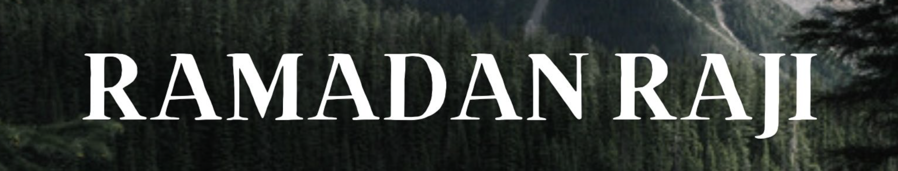
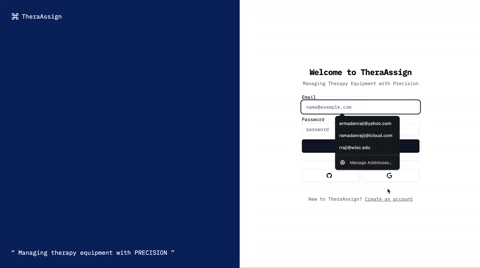
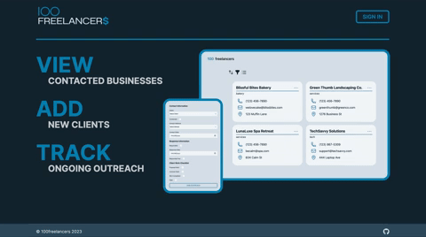
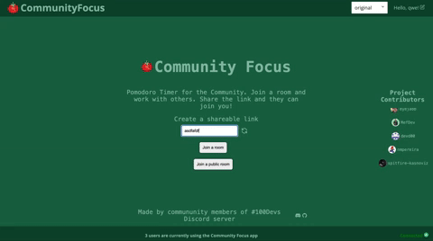

  

###

<h1 align="left">Hi, I'm Ramadan</h1>

###

I am a Software Engineer in the MERN stack world🌍. I enjoy creating user-centric applications that solve problems,whether working independently or as part of a team. 
  
- 🔭 Currently, I'm working on [TheraAssign](https://thera-assign.vercel.app/) , a hospital patient rehabilitation management software designed to streamline and track equipment and resources in rehab hospitals. This project aims to enhance patient care and improve operational efficiency.
- 📚 I’ve been deep diving into Cloud infrastructure (DevOps) with AWS to better understand scalable solutions and improve the deployment efficiency as it's crucial for optimizing application performance and reliability in a cloud environment.
- ⚡ In my free time, I am usually engaged in portrait/landscape photography or drone piloting. Want to see some of my artistic skills? Check out [my photography website](https://ramadanrajiphotography.squarespace.com).

###

###

<h3 align="left">🛠 Language and tools</h3>

#### Frontend

  
  
  
  
  
  

#### Backend

  
  
  
  
  

## Projects and Contributions:

###

<table bordercolor="#66b2b2">
  <tr>
    <td width="50%" valign="top">
      <h3 align="center">TheraAssign</h3>
         
        
         
        

           
          
      

      
<strong>NextJs, ReactJS, Node.js, Express.js, MongoDB, Prisma</strong> - A hospital patient rehabilitation management software designed to streamline and track equipment and resources in rehab hospitals. This application aims to enhance patient care and improve operational efficiency.

    </td>
    <td width="50%" valign="top">
      <h3 align="center">100 Freelancers</h3>
         
        
         
        

            
          
      

      
<strong>React, NextJs, Express, MongoDB, Node.Js, JavaScript</strong> - A software that streamlines client management for freelance software engineers, offering an efficient alternative to spreadsheets. Simplifies adding, viewing, and tracking clients, and enhances the monitoring of ongoing projects for effective client engagement.

    </td>
  </tr>
  <tr>
    <td colspan="2" valign="top">
      <h3 align="center">Community Focus</h3>
         
        
         
        

            
          
      

      
<strong>ReactJS, TypeScript, Node.js, Express.js, MongoDB</strong> - A sharable time  time tracking app for the 40,000 members of the 100Devs Discord. Features include the ability to create virtual solo and group working rooms, sharable link timers.

    </td>
  </tr>
</table>

  
  

###
