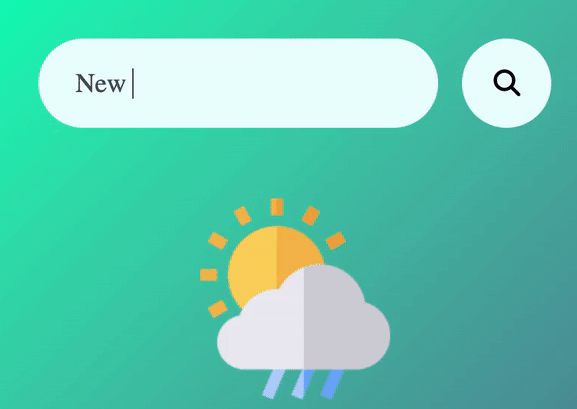

  
  
  
  

As a Full-Stack Software Engineer, I am motivated by the power of technology as a tool for positive change, with a background in Research, Physics, and Business Management.

See [my website](https://ramadan-raji.netlify.app) for more information!

<h1 align="center">Projects</h1>
<table bordercolor="#66b2b2">
  
  <tr>
    <td width="50%" valign="top">
      <h3 align="center">GeoClimate: Real-Time Weather Dashboard</h3>
         
        
         
        

          
    
  
      

        
<strong>HTML5, CSS3, & Javascript </strong> Catch the Weather on the Go! 🌤️ Simply type a city, get live updates on temperature, humidity, wind speed & more!Try it out <a href='https://github.com/RamadanCRaji/GeoClimateWeatherApp'> here! </a>💨

    </td>
    <!-- <td width="50%" valign="top">
      <h3 align="center">Rigley 2: "Flappy Bug"</h3>
         
      
         
        

          
  
  
      

        
<strong>Javascript & Phaser.js</strong> - The awaited sequel sees our Rigley friend jumping through firewalls "Flappy Bird" style.

    </td>   -->
  </tr>
  
  <tr>
    <!-- <td width="50%" valign="top">
      <h3 align="center">ShawnCharles.com</h3>
       
        
       
        

  
  
      

        
<strong>HTML5, CSS3, & Javascript</strong> - Portfolio Site including links to my projects and ways to get in contact with me.

    </td> -->
    <!-- <td width="50%" valign="top">
      <h3 align="center">Matching Cards</h3>
         
        
         
        

           -->
  
  
      <!-- 

        
<strong>HTML5, CSS3, & Javascript</strong> - With over 100 different cards, test your memory in these three popular trading card themes, Pokemon, Yugioh, & Magic: The Gathering!

    </td> -->
  </tr>
</table>

<h1 align="center">Technologies</h1>

    
    
    
    
    
    
    
    
    
    
    
    
    

---

<h1 align="center">Connect</h1>

  
  
  
  

